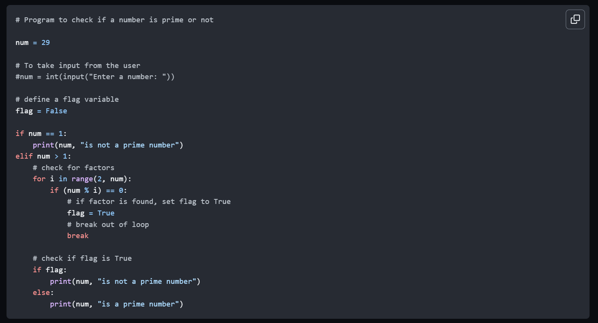

# Writing Good Documentation

## Step 1 - Using Codeblocks.

Codeblocks in markdown make it *very easy* for tech people to **copy, paste, share** code.
A good __Cloud Engineer__ uses Codeblocks whenever possible.

Because it allows others to copy and paste their code to replicate or research issues.

- In order to create codeblocks in markdown you need to use three backticks (`)
- Not to be confused with quotation (') 

```
# Program to check if a number is prime or not

num = 29

# To take input from the user
#num = int(input("Enter a number: "))

# define a flag variable
flag = False

if num == 1:
    print(num, "is not a prime number")
elif num > 1:
    # check for factors
    for i in range(2, num):
        if (num % i) == 0:
            # if factor is found, set flag to True
            flag = True
            # break out of loop
            break

    # check if flag is True
    if flag:
        print(num, "is not a prime number")
    else:
        print(num, "is a prime number")
```

- When you can you should attempt to apply syntax highlighting to your codeblocks.

```python
# Program to check if a number is prime or not

num = 29

# To take input from the user
#num = int(input("Enter a number: "))

# define a flag variable
flag = False

if num == 1:
    print(num, "is not a prime number")
elif num > 1:
    # check for factors
    for i in range(2, num):
        if (num % i) == 0:
            # if factor is found, set flag to True
            flag = True
            # break out of loop
            break

    # check if flag is True
    if flag:
        print(num, "is not a prime number")
    else:
        print(num, "is a prime number")
```

- Make note of where the backtick keybaord key is located.
- It should appear above the tab key,
- but it may vary based on your keyboard layout.


Good Cloud Engineers use codeblocks for both Code and Errors that appear in the console.

```bash
Traceback (most recent call last):
  File "<stdin>", line 1, in <module>
ZeroDivisionError: division by zero
```

> Here is an example of using a codeblock for an error that appears in bash.

When you can always provide a codeblock instead of a screenshot. 
If you need to take a screenshot make sure it's not a photo from your phone.

> There are certain cases where its okay to take photos with your phone. This is when you are showing something like a keyboard, which does not appear on a computer screen.
If it renders on your computer screen it should be a sreenshot.

## Step 2 - How to take screenshots 

A screenshot is when you capture a part of your screen from your laptop, desktop, or phone.

This is not to be confused with taking a photo with your phone.

**DON'T DO THIS**


This is what a screenshot from your computer should look like 

**DO THIS INSTEAD**



- The easiest way in Windows 10 and 11 to call up Snip & Sketch is with the keyboard shortcut **Windows key + Shift + S**.
To capture your entire screen, tap the **Print Screen** (sometimes labeled **PrtScn**) key. Your screenshot won't be saved as a file, 
but it will be copied to the clipboard. 

- To take a screenshot on your Mac, press and hold these three keys together: **Shift, Command, and 3**. 
If you see a thumbnail in the corner of your screen, click it to edit the screenshot. Or wait for the screenshot to save to your desktop.

- How to capture a portion of the screen on your Mac: Press and hold these three keys together: **Shift, Command, and 4**.
Drag the crosshair  to select the area of the screen to capture. To move the selection, press and hold Space bar while dragging. To cancel taking the screenshot, press the Esc (Escape) key.


## Step 3 - Use Github Flavoured Markdown Task Lists

Github extends Markdown to have a list where you can check off items. [<sup>[1]</sup>](#external-references)

- [x] Finish step 1
- [ ] Finish step 2
- [x] Finish step 3

## Step 4 - Use Emojis (Optional)

Github Flavoured Markdown (GFM) supports emoji shortcodes. 
Here are some examples:


| Name  | Shortcode | Emoji |
| --- | --- | --- |
| Cloud  | `:cloud:` | :cloud: |
| Cloud with lightning | `:cloud_with_lightning:` | 🌩️ |

## Step 5 - How to create a table

You can use the following markdown format to creat tables:
```md
| Name  | Shortcode | Emoji |
| --- | --- | --- |
| Cloud  | `:cloud:` | :cloud: |
| Cloud with lightning | `:cloud_with_lightning:` | 🌩️ |
```
Github extends the functionality of Markdown tables to provide more alignment and table cell formatting options. [<sup>[2]</sup>](#external-references)

- Make note of where the pipe keybaord key is located.
- It should appear above the retun or enter key
- but it may vary based on your keyboard layout.


[Secret Window Hidden Garden](secret-window/hidden-garden.md)

## External References

- [Github Markdown - Basic writing and formatting syntax](https://docs.github.com/en/get-started/writing-on-github/getting-started-with-writing-and-formatting-on-github/basic-writing-and-formatting-syntax) 

- [Python Program to Check Prime Number](https://www.programiz.com/python-programming/examples/prime-number) 

- [typing a backtick on Mac OS X Snow Leopard](https://apple.stackexchange.com/questions/69820/typing-a-backtick-on-mac-os-x-snow-leopard)

- [GFM - Task Lists](https://docs.github.com/en/get-started/writing-on-github/getting-started-with-writing-and-formatting-on-github/basic-writing-and-formatting-syntax#task-lists) <sup>[1]</sup>

- [GFM - Emoji Cheatsheet](https://github.com/ikatyang/emoji-cheat-sheet/blob/master/README.md)
- [GFM - Tables (with extensions)](https://github.github.com/gfm/#tables-extension-) <sup>[2]</sup>
- [8 Easy Ways to Take Screenshots in Windows 10 and 11](https://www.cnet.com/tech/services-and-software/8-easy-ways-to-take-screenshots-in-windows-10-and-11/)
- [Take a screenshot on your Mac](https://support.apple.com/en-us/HT201361)

  
